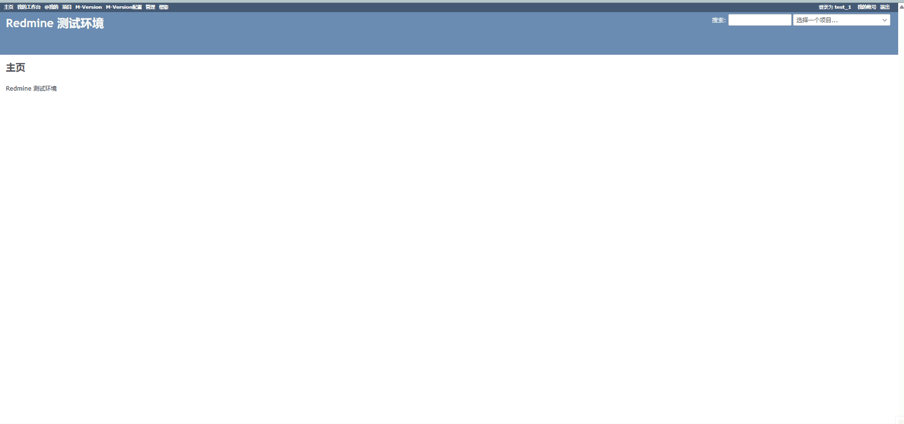
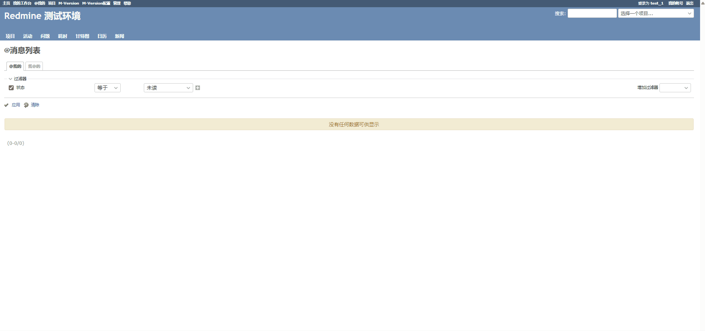
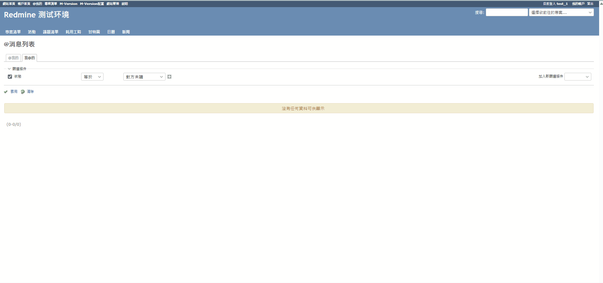
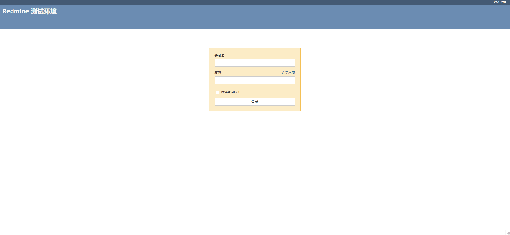
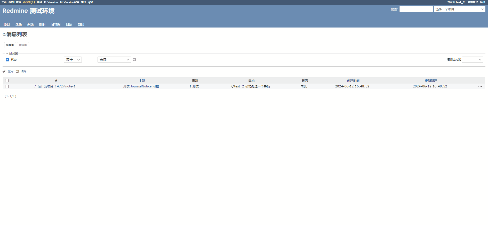
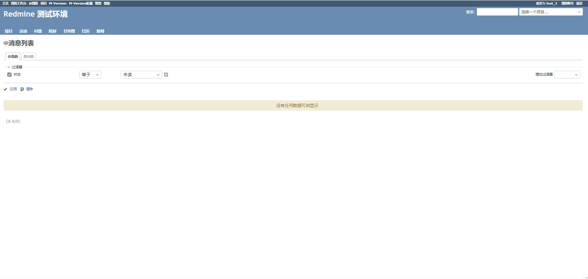
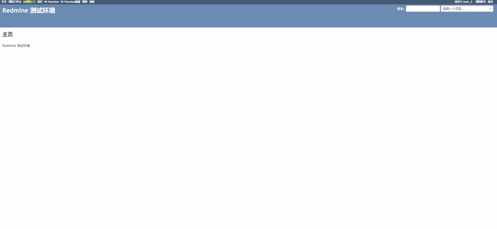

# JournalNotice(@me) 插件介绍

## 概述

本插件主要解决当 redmine 发送的邮件较多时，你可能会错过别人 `@你` 的消息这个问题。

## 使用要求

1. 使用本插件的用户**不能是匿名用户**。
2. 使用本插件的用户对项目必须有：`添加关注者`权限。

## 权限管理

所有非匿名用户登录后都可以使用本插件。

## 功能列表

1. `@我的` 消息记录和提醒
2. `@我的` 消息状态设置（已读、未读）
3. `我@的` 消息状态查看（对方已读、对方未读）
4. 消息筛选
5. 消息跳转
6. 中文、繁体中文、英文支持

## 插件界面介绍

### 简体中文界面

### 繁体中文界面

### 英文界面

## 插件功能演示

### @我的消息记录和提醒

1. test_1 用户在问题的评论中 @test_2 用户，同时 test_1 用户可以看到 `我@的` 消息

2. test_2 用户可以看到 `@我的` 消息

### 消息状态设置

1. test_2 用户将消息设置为`已读`

2. test_1 用户可以查看到`对方已读`状态

### 消息筛选

#### @我的 消息筛选

#### 我@的 消息筛选

### 消息跳转

### 语言支持

插件语言跟随系统语言转换，当前支持：中文、繁体中文、英文

## 注意事项

1. 一条评论里面可以同时@多个人，被@的用户（包括自己）都会在`@我的`中收到消息。
2. 插件识别用户的方式和 redmine 识别用户的方式相同， `@{用户名}[空格]` 以@开头，以空格结尾，中间是用户的登录名（开启`添加关注者`权限后，redmine 会有自动提醒）

